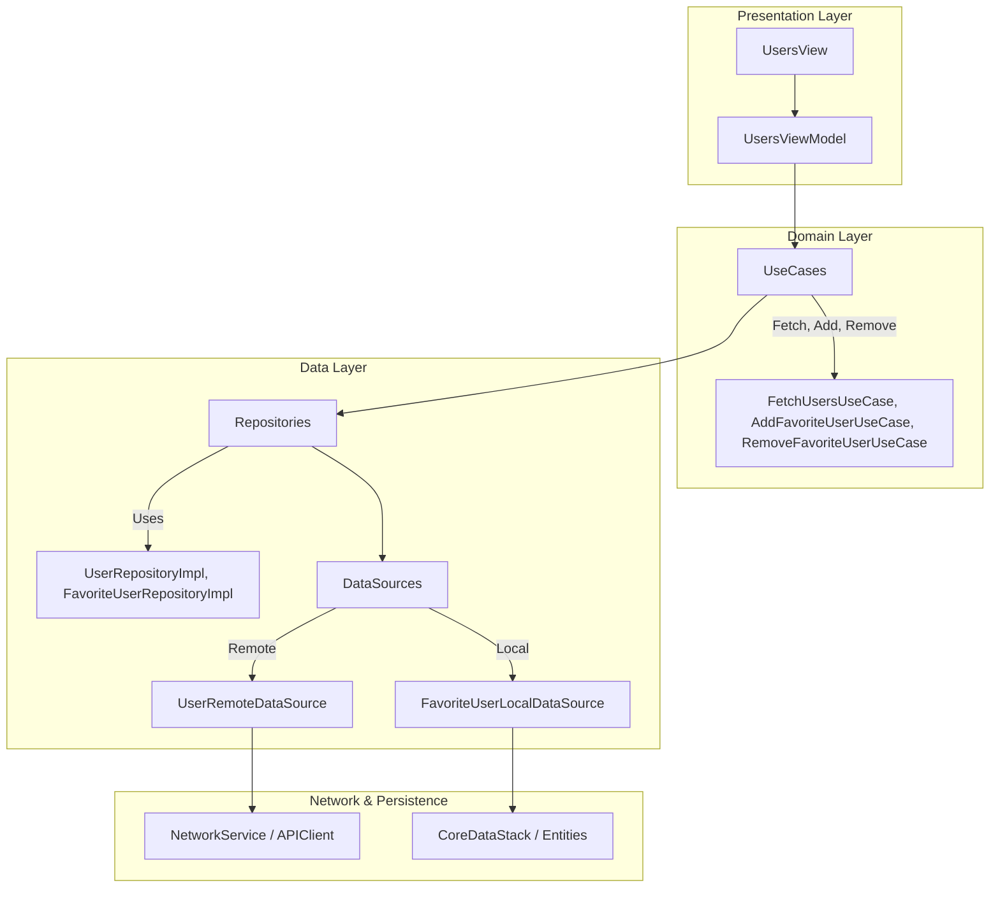

# Modernist Case

A sample iOS application built using **SwiftUI**, **Combine**, and **Core Data**, showcasing a clean architecture approach with dependency injection.

---

## 📌 About the Project

**Modernist Case** is a SwiftUI-based app that fetches users from a remote source and allows users to manage a favorites list.

- Clean architecture with separation of concerns
- Local persistence with **Core Data**
- Reactive programming with **Combine**
- Dependency Injection with a centralized container

---

## ✨ Features

- ✅ User Listing** – Fetches and displays users from a remote API  
- 🔍 **Search Functionality** – Filter users by name  
- ⭐️ **Favorites Management** – Add/remove users from favorites  
- 💾 **Persistent Storage** – Stores favorites using Core Data  
- 🔁 **Reactive Updates** – Real-time UI updates using Combine  
- 🧩 **Modular Architecture** – Domain, Data, and Presentation layers  
- 🧭 **Navigation** – SwiftUI’s `NavigationStack` with custom route management

## 🏗 Architecture

The project follows a **Clean Architecture** approach with distinct layers for **Domain**, **Data**, and **Presentation**. It promotes separation of concerns, testability, and scalability for larger applications.

## 📊 Diagram



### 🔄 Data Flow

1. **ViewModel** (e.g., `UsersViewModel`) interacts with **UseCases**
2. **UseCases** execute business rules using **Repositories**
3. **Repositories** call either:
   - **RemoteDataSource** for network,
   - or **LocalDataSource** for CoreData
4. Results are published with **Combine** to the UI

### 🔧 Dependency Injection

- Dependencies are registered centrally using `AppDIContainer`
- `MainTabView` injects dependencies manually into ViewModels using `@StateObject`
- This keeps view initialization simple and flexible, and improves testability

## 🧭 Custom Navigation

The project uses a centralized navigation system called `GlobalNavigationManager`, instead of relying directly on SwiftUI's `NavigationLink` everywhere. This provides better control and decouples navigation logic from the view layer.

### How It Works

- `GlobalNavigationManager` is a singleton `ObservableObject` that holds the `@Published var fullCoverPath`, which drives the `NavigationStack`.
- It exposes `push()` and `pop()` methods to programmatically navigate to and from views.

```swift
@MainActor
class GlobalNavigationManager: ObservableObject {
    static let shared = GlobalNavigationManager()
    
    @Published var fullCoverPath: [ParkyViewName] = []
    
    func push(_ view: ParkyViewName, to path: ReferenceWritableKeyPath<GlobalNavigationManager, [ParkyViewName]> = \.fullCoverPath) {
        DispatchQueue.main.async {
            self[keyPath: path].append(view)
        }
    }

    func pop(from path: ReferenceWritableKeyPath<GlobalNavigationManager, [ParkyViewName]> = \.fullCoverPath) {
        DispatchQueue.main.async {
            if !self[keyPath: path].isEmpty {
                self[keyPath: path].removeLast()
            }
        }
    }
}
```

## 🌐 Network Layer

The project includes a robust and modular network layer built on top of `Combine`, designed for scalability, testability, and clean separation of concerns.

### 🔧 APIClient Protocol

The `APIClient` protocol defines the expected behavior of any network client:

```swift
protocol APIClient {
    func request<T: Decodable>(_ endpoint: UserAPI, responseType: T.Type) -> AnyPublisher<T, NetworkError>
}
```

### 🚀 NetworkService

`NetworkService` is a singleton implementation of the `APIClient` protocol, responsible for making HTTP requests, decoding responses, and handling network-related errors.

#### 🔑 Key Features

- ✅ **Combine-based networking** using `URLSession`.
- ✅ **Automatic JSON decoding** with `JSONDecoder`, using:
  - `keyDecodingStrategy = .convertFromSnakeCase`
  - `dateDecodingStrategy = .iso8601`
- ✅ **HTTP status code validation**:
  - Handles `2xx` success
  - Throws appropriate errors for `4xx` and `5xx`
- ✅ **Detailed logging** for debugging:
  - Request method, URL, headers, and body
  - Response status code and pretty-printed JSON
- ✅ **Error handling** via a custom `NetworkError` enum:
  - `.decodingError`, `.unauthorized`, `.notFound`, `.serverError`, `.urlError`, `.unknown`, etc.

#### 🧪 Example Usage

```swift
NetworkService.shared
    .request(.getUsers(page: 1, results: 20, seed: "xyz"), responseType: UserResponse.self)
    .sink(receiveCompletion: { completion in
        // handle success or error
    }, receiveValue: { response in
        // use response
    })
    .store(in: &cancellables)
```


